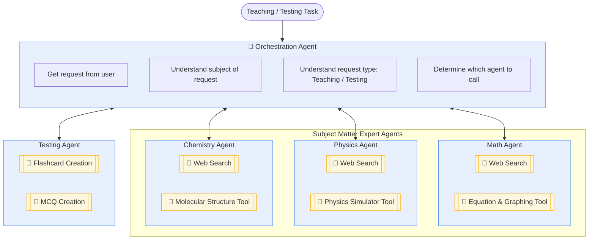

# Multi-Agent Educational & Testing System (METS)

**Team Members:**
- Sritam Patnaik — A0115530W
- Gu Haixiang — A0131920U
- Chua Hieng Weih — A0315386Y
- Lizabeth Annabel Tukiman — A0315378X
- Muhammad Harun Bin Abdul Rashid — A0164598L

---

## Overview

In alignment with Singapore's National Artificial Intelligence Strategy and the Ministry of Education's EdTech Masterplan 2030, modern digital learning frameworks face an ongoing challenge: scaling personalized instruction and targeted assessments while keeping content rigorous, safe, and pedagogically sound. Traditional monolithic software systems struggle to adapt dynamically to diverse student intents, whether a learner needs deep conceptual guidance in physics, curriculum-aligned research support in chemistry, or customized testing materials.

The Multi-Agent Educational & Testing System (METS) solves this educational problem within the Singapore context by deploying a specialized Agentic AI solution. By democratizing personalized tuition, this solution makes the benefits of private tuition agencies far more accessible to students across all socioeconomic backgrounds. METS automates instructional delivery and student evaluation while adhering strictly to local governance frameworks. By routing queries through a hierarchical multi-agent architecture, the system provides a secure, reliable educational assistant that handles open-ended inquiries, retrieves verified information using Retrieval-Augmented Generation (RAG), and dynamically builds interactive learning aids and quizzes.

---

## General Flow

From a student's point of view, interacting with METS follows a seamless, conversational journey:

1. **Task Ingestion:** The student logs into the platform and asks a specific academic question or requests practice material (e.g., asking for help solving a calculus problem or requesting a quiz on chemical bonding). Additionally, we collect the student's grade level and evaluate their basic understanding of subjects through simple diagnostic questions, while remembering key information from past 10 chats to deeply personalize their experience.
2. **Orchestration & Intent Routing:** The top-level Orchestration Agent receives the student's request, figures out which subject it belongs to, and decides whether the student wants to learn a concept (Teaching) or test their knowledge (Testing).
3. **Execution Phase:**
   - **If Teaching:** The Orchestration Agent hands the request over to the relevant Subject Agent (Math, Physics, or Chemistry). That agent uses its specialized tools and RAG search to pull up curriculum documents, break down formulas, or calculate solutions step by step.
   - **If Testing:** The Orchestration Agent routes the request to the Testing Agent, which instantly generates custom flashcards or multiple-choice questions for the student to practice with.
4. **Response Delivery:** The student receives a clear, structured explanation or interactive quiz directly on their screen, ready for the next question.

### Architecture Diagram

**Notes:**
- **Orchestration Agent** — gets the request from the user, understands the subject, understands whether it's a Teaching or Testing request, and plans which downstream agent to call.
- **Subject Matter Expert (SME) Agents** — receive context from the Orchestration Agent, have RAG capabilities, and return an answer/content back to the Orchestration Agent. The request from the Orchestrator could be for direct Q&A, or just for content in a certain format (e.g., to hand off to the Testing Agent).
- **Testing Agent** — generates flashcards or quizzes based on content sourced from the relevant SME Agent.

---

## Scope of Work

METS implements a Hierarchical Orchestration architecture, balancing global system control with local agent autonomy. Below is a breakdown of the system agents, followed by how the implementation addresses critical AI governance and operational dimensions.

### System Agents

- **Orchestration Agent (Master Controller):** Responsible for high-level intent recognition, qualifying whether the user query is intended for primary school, secondary school, or junior college (JC) levels, task parsing, multi-layer decision-making, and routing payloads to downstream subject or testing agents. On each session, the Orchestrator queries the **Student Profile & Memory Module** (below) to retrieve the student's grade level, diagnostic proficiency signals, and relevant context from the past 10 chats, and uses this to inform routing and to pass personalization context downstream to SME/Testing agents.

- **Student Profile & Memory Module *(new)*:** Maintains (a) student grade level and subject proficiency, captured via lightweight diagnostic questions at first use, and (b) a rolling short-term memory of the student's last 10 conversations. Exposed as a tool the Orchestration Agent calls during Task Ingestion; SME and Testing agents receive relevant memory/profile context as part of their input payload so explanations and quiz difficulty can be tailored to the individual student rather than treated as a stateless request.

- **Math Agent (Subject Agent 1):** Autonomous agent specializing in mathematical concepts, equipped with an Equation Solver Tool for step-by-step algebraic manipulation and a Document Search (RAG) Tool for syllabus reference (e.g. O levels and A levels).

- **Physics Agent (Subject Agent 2):** Autonomous agent specializing in physical laws and mechanics, equipped with a Formula & Unit Converter Tool for precise calculations and a Document Search (RAG) Tool.

- **Chemistry Agent (Subject Agent 3):** Autonomous agent specializing in chemical equations and molecular structures, equipped with a Periodic Table & Reaction Balancer Tool and a Document Search (RAG) Tool.

- **Testing Agent:** Specialized agent governing assessment generation, utilizing automated tools for flashcard compilation and MCQ construction.

### Key Considerations & Governance

- **Assurance & Trust:** Grounding SME responses via RAG document search minimizes hallucinations and ensures that educational content aligns with verified curricula.
- **Explainability & Accountability:** The hierarchical workflow logs every routing decision made by the Orchestration Agent and tracks which SME or tool generated a specific output, providing a clear audit trail for educators.
- **Fairness & Ethical Issues:** Curated document repositories and strict prompt constraints prevent bias, ensuring objective, equitable content delivery across all student demographics, aligning with local AI governance principles.
- **Security Measures:** Secure API gateways, strict access controls on vector databases, and input/output sanitization protect against prompt injection and unauthorized data access.
- **Agent Autonomy & Orchestration:** Built using a hierarchical model combining centralized master control with decentralized SME tool execution to handle complex, multi-layered workflows without system bottlenecks.
- **MLOps & LLMOps Practices:** Incorporates systematic prompt versioning, evaluation pipelines for retrieval accuracy, latency monitoring, and automated logging of agent trajectories.

---

## Effort Estimates

We have mapped out the work into clear project phases with estimated timelines. Effort is shown in person-days, based on a team of 5 members (≈15 person-days each, ≈75 person-days total).

| Phase / Task ID | Work Breakdown Structure (WBS) Task | Duration | Assigned | Person-Days |
|---|---|---|---|---|
| **Phase 1** | **Core Architecture & Orchestration Setup** | **2 Weeks** | | **25 pd** |
| 1.1 | Design hierarchical agent communication framework and state management. | 1 Week | 2 members | 10 pd |
| 1.2 | Implement Orchestration Agent intent recognition and routing logic. | 1 Week | 2 members | 10 pd |
| 1.3 | Implement student profile intake, diagnostic assessment logic, and short-term memory (last 10 chats) module. | 1 Week (parallel) | 1 member | 5 pd |
| **Phase 2** | **SME Agents & RAG Pipeline Integration** | **3 Weeks** | | **30 pd** |
| 2.1 | Set up vector database and ingest curated subject documents (Math, Physics, Chemistry). Store syllabus and curriculum, not the subject knowledge. | 1 Week | 2 members | 10 pd |
| 2.2 | Develop SME Agents with integrated Document Search and Web Search tools. | 2 Weeks | 2 members | 20 pd |
| **Phase 3** | **Testing Module & Tool Development** | **2 Weeks** | | **10 pd** |
| 3.1 | Implement Flashcard Creation tool and integrate with Testing Agent. | 1 Week | 1 member | 5 pd |
| 3.2 | Implement MCQ Creation tool, answer-key generation, and formatting constraints. | 1 Week | 1 member | 5 pd |
| **Phase 4** | **Governance, LLMOps, & End-to-End Testing** | **2 Weeks** | | **10 pd** |
| 4.1 | Establish logging, tracing, prompt versioning, and security/guardrail measures. | 1 Week | 1 member | 5 pd |
| 4.2 | Conduct system integration testing, latency optimization, and user acceptance evaluation. | 1 Week | 1 member | 5 pd |
| **Total Estimated Project Timeline** | | **9 Weeks** | | **75 pd** |

