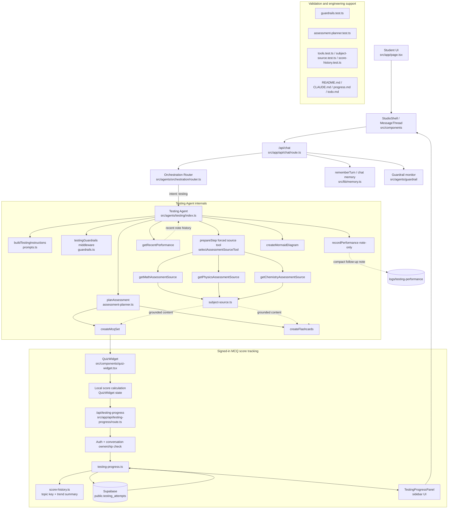

# Testing Agent Architecture

This diagram focuses on the **Testing Agent slice owned by Harun** and shows how assessment generation, score tracking, and persistence fit into the wider METS flow. The score-tracking path is now live against the Supabase `public.testing_attempts` table in initial signed-in testing.

## Key design points

- **One public Testing agent only**: Orchestration selects Testing; Testing does not call other specialist agents directly.
- **Separation of concerns**:
  - `guardrails.ts` filters obvious Testing-specific integrity or prompt-disclosure failures without replacing the hidden Guardrail agent
  - `subject-source.ts` grounds content
  - `assessment-planner.ts` decides mode/topics/visual need
  - widget tools render structured MCQ or flashcard payloads
  - score tracking is a separate persistence flow from note logging
- **`recordPerformance` stays note-only**: score tracking does **not** overload the earlier Testing note log.
- **Local guardrails stay narrow**: the Testing middleware blocks obvious hidden-prompt disclosures, live-paper wording leaks, and answer-key dumps in prose, but broader student-safety escalation still belongs to `src/agents/guardrail/`.
- **Score history grouping**: repeated MCQ attempts are grouped by **subject + topic/family + mode** so the UI can show improvement, regression, or stability.
- **Deployment boundary**: the score-history flow depends on the migration-defined `public.testing_attempts` schema; once that table exists, the same API/UI path works without code changes.
- **Validation-first design**: strict note-only logging, tool schemas, guardrail tests, planner tests, and score/source regressions support software-engineering grading points such as modularity, explicit contracts, and testability.
